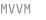

<a href="README.md">English</a> · <b>Español</b>

### Stack

**Backend** &ensp;

**Web** &ensp;

**Escritorio** &ensp;

**Móvil** &ensp;

**Datos** &ensp;

**Entrega** &ensp;

**Arquitectura** &ensp;

### Contacto

Disponible para trabajo full-stack, backend y de escritorio — remoto o en el Atlántico.
