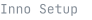

<b>English</b> · <a href="README.es.md">Español</a>

I work from Soledad, Atlántico, Colombia. I build REST APIs and backend services with Node.js, Spring Boot and FastAPI, web interfaces with React and Next.js, native desktop applications with C++/Qt and .NET WPF, and Android apps with Kotlin and Compose.

Almost everything I build, I also ship — packaged, versioned, running in production or installed on someone's machine. I'm a Software Analysis and Development technologist (SENA), now studying Systems Engineering at Fundación Universitaria del Área Andina.

### Experience

**Software Developer** — Club Deportivo Popular Junior FC S.A. · 6 months 
REST APIs and backend services in Node.js and Spring Boot that automate the club's internal administrative processes, and the React / Next.js admin interfaces on top of them. WPF desktop tools for the workflows the web system didn't cover. MySQL and SQLite schemas, and production services kept running under PM2.

### Projects

**[Chimera](https://github.com/Losif24/chimera-releases)** — A desktop environment for reading and maintaining a codebase: it indexes the project and maps what depends on what. 
`Python` `Qt 6` `QML` — 12 releases

**[Trading Tuff](https://github.com/Losif24/TradingTuff)** — A Windows terminal for reading a market in real time: live data and a chart engine written from scratch. 
`C++17` `Qt 6` `SQLite` — 202 downloads

180 versions shipped · 214 installer downloads · on GitHub since 2022

### Stack

<!-- stack:start -->
**Backend** &ensp;

**Web** &ensp;

**Desktop** &ensp;

**Mobile** &ensp;

**Data** &ensp;

**Delivery** &ensp;

**Architecture** &ensp;

<!-- stack:end -->

### Contact

Open to full-stack, backend and desktop work — remote or in Atlántico, Colombia.

<!-- Pega aquí tus enlaces y vuelve a subir:
[LinkedIn](https://linkedin.com/in/TU_USUARIO) · tu@correo.com
-->
